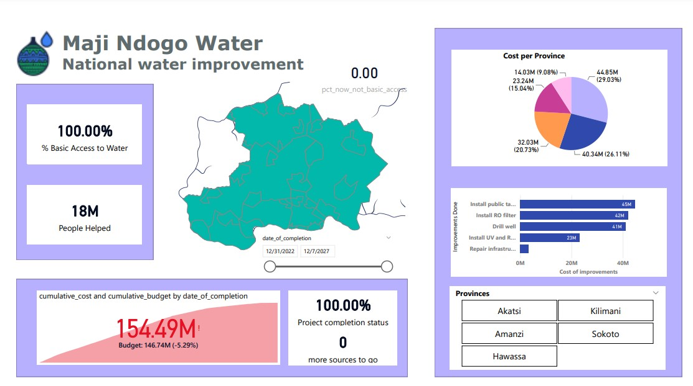
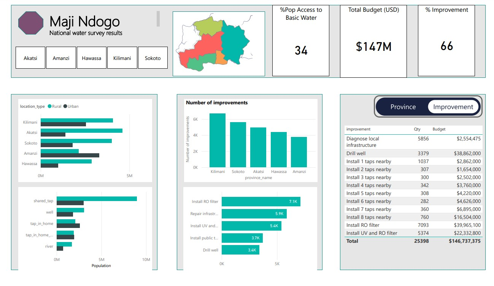

# My Data Analysis Portfolio

Welcome to my portfolio showcasing static dashboards created using Power BI.

[View Full Dashboard](dashboard1.pdf)

## **Projects on UN SDG Goal 6: Clean Water and Sanitation**

During my time in the **ALX Data Science Program**, I worked on multiple projects addressing the United Nations **SDG Goal 6**, which emphasizes ensuring access to clean water and sanitation for all. Below are highlights of my contributions:

### **1. Identifying Clean Water Sources in Communities**
- **Objective**: Analyze water supply and types of sources to determine which communities have access to clean water.
- **Key Outcomes**:
  - Conducted in-depth data analysis to identify disparities in water access across various regions.
  - Pinpointed communities with unsafe water sources, enabling targeted interventions.

### **2. Infrastructure Development for Water Resource Allocation**
- **Objective**: Address insufficient water resources and optimize infrastructure development.
- **Key Outcomes**:
  - Identified areas where water sources were inadequate to meet community needs.
  - Designed data-driven strategies for efficient resource allocation, ensuring sustainable infrastructure projects.
  - Monitored project progress using advanced analytical dashboards to ensure accountability and transparency.

### **3. Resource Monitoring and Progress Tracking**
- **Objective**: Create tools to efficiently allocate resources and track project development.
- **Key Outcomes**:
  - Developed dashboards to visualize water resource availability, enabling decision-makers to allocate resources effectively.
  - Ensured projects adhered to timelines and goals, improving the overall impact on underserved communities.

[View Full Dashboard](dashboard2.pdf)
